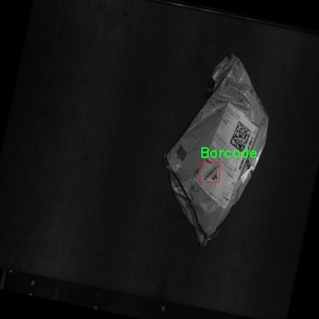

# 改进yolo11-RVB等200+全套创新点大全：快递包裹条形码与二维码识别系统源码＆数据集全套

### 1.图片效果展示


##### 项目来源 **[人工智能促进会 2024.11.01](https://kdocs.cn/l/cszuIiCKVNis)**

注意：由于项目一直在更新迭代，上面“1.图片效果展示”和“2.视频效果展示”展示的系统图片或者视频可能为老版本，新版本在老版本的基础上升级如下：（实际效果以升级的新版本为准）

  （1）适配了YOLOV11的“目标检测”模型和“实例分割”模型，通过加载相应的权重（.pt）文件即可自适应加载模型。

  （2）支持“图片识别”、“视频识别”、“摄像头实时识别”三种识别模式。

  （3）支持“图片识别”、“视频识别”、“摄像头实时识别”三种识别结果保存导出，解决手动导出（容易卡顿出现爆内存）存在的问题，识别完自动保存结果并导出到tempDir中。

  （4）支持Web前端系统中的标题、背景图等自定义修改。

  另外本项目提供训练的数据集和训练教程,暂不提供权重文件（best.pt）,需要您按照教程进行训练后实现图片演示和Web前端界面演示的效果。

### 2.视频效果展示

[2.1 视频效果展示](https://www.bilibili.com/video/BV1XaDPYNEBa/)

### 3.背景

研究背景与意义

随着电子商务的迅猛发展，快递行业的业务量不断攀升，包裹的管理与追踪成为了行业内亟待解决的重要问题。条形码和二维码作为信息存储与传递的有效工具，广泛应用于快递包裹的标识与追踪中。传统的条形码与二维码识别方法在复杂环境下的准确性和实时性往往难以满足现代快递物流的需求。因此，开发一种高效、准确的快递包裹条形码与二维码识别系统显得尤为重要。

本研究基于改进的YOLOv11模型，旨在构建一个高效的快递包裹条形码与二维码识别系统。YOLO（You Only Look Once）系列模型以其快速的检测速度和较高的准确率在目标检测领域取得了显著成效。通过对YOLOv11进行改进，结合特定的快递包裹数据集，能够更好地适应快递行业的实际应用场景。该数据集包含1400张图像，专注于条形码和二维码的检测，提供了丰富的样本数据，能够有效支持模型的训练与验证。

在实际应用中，快递包裹的条形码和二维码常常受到环境光照、角度、遮挡等因素的影响，导致识别准确率下降。通过改进YOLOv11模型，增强其对不同环境条件的适应能力，将显著提升识别系统的稳定性与可靠性。此外，系统的实时性将为快递企业提供更高效的包裹处理能力，降低人工成本，提高物流效率。

综上所述，基于改进YOLOv11的快递包裹条形码与二维码识别系统的研究，不仅具有重要的理论意义，也为快递行业的智能化发展提供了实践基础，推动了物流信息化的进程。

### 4.数据集信息展示

##### 4.1 本项目数据集详细数据（类别数＆类别名）

nc: 2
names: ['Barcode', 'qrcode']


该项目为【目标检测】数据集，请在【训练教程和Web端加载模型教程（第三步）】这一步的时候按照【目标检测】部分的教程来训练

##### 4.2 本项目数据集信息介绍

本项目数据集信息介绍

本项目所使用的数据集名为“qqr4j”，旨在为改进YOLOv11的快递包裹条形码与二维码识别系统提供高质量的训练数据。该数据集专注于两个主要类别的识别任务，分别是“Barcode”（条形码）和“qrcode”（二维码），总类别数量为2。这一设计使得数据集能够涵盖快递包裹中常见的标识符，进而提高系统在实际应用中的识别准确性和效率。

“qqr4j”数据集的构建过程经过精心设计，确保了数据的多样性和代表性。数据集中包含了来自不同快递公司和不同包裹类型的条形码与二维码样本，涵盖了各种尺寸、颜色和背景条件。这种多样性不仅能够帮助模型学习到更为广泛的特征，还能提高其在复杂环境下的鲁棒性。此外，数据集中的每个样本都经过标注，确保了训练过程中模型能够准确识别并区分这两种类别。

在数据集的准备过程中，研究团队还特别关注了样本的质量和清晰度，以确保每个条形码和二维码的可读性。这对于训练深度学习模型至关重要，因为高质量的输入数据直接影响到模型的学习效果和最终的识别性能。通过使用“qqr4j”数据集，研究人员期望能够显著提升YOLOv11在快递包裹条形码与二维码识别任务中的表现，使其在实际应用中能够快速、准确地处理各种快递信息，从而优化物流管理和提高工作效率。




### 5.全套项目环境部署视频教程（零基础手把手教学）

[5.1 所需软件PyCharm和Anaconda安装教程（第一步）](https://www.bilibili.com/video/BV1BoC1YCEKi/?spm_id_from=333.999.0.0&vd_source=bc9aec86d164b67a7004b996143742dc)


[5.2 安装Python虚拟环境创建和依赖库安装视频教程（第二步）](https://www.bilibili.com/video/BV1ZoC1YCEBw?spm_id_from=333.788.videopod.sections&vd_source=bc9aec86d164b67a7004b996143742dc)

### 6.改进YOLOv11训练教程和Web_UI前端加载模型教程（零基础手把手教学）

[6.1 改进YOLOv11训练教程和Web_UI前端加载模型教程（第三步）](https://www.bilibili.com/video/BV1BoC1YCEhR?spm_id_from=333.788.videopod.sections&vd_source=bc9aec86d164b67a7004b996143742dc)


按照上面的训练视频教程链接加载项目提供的数据集，运行train.py即可开始训练



     Epoch   gpu_mem       box       obj       cls    labels  img_size
     1/200     20.8G   0.01576   0.01955  0.007536        22      1280: 100%|██████████| 849/849 [14:42<00:00,  1.04s/it]
               Class     Images     Labels          P          R     mAP@.5 mAP@.5:.95: 100%|██████████| 213/213 [01:14<00:00,  2.87it/s]
                 all       3395      17314      0.994      0.957      0.0957      0.0843

     Epoch   gpu_mem       box       obj       cls    labels  img_size
     2/200     20.8G   0.01578   0.01923  0.007006        22      1280: 100%|██████████| 849/849 [14:44<00:00,  1.04s/it]
               Class     Images     Labels          P          R     mAP@.5 mAP@.5:.95: 100%|██████████| 213/213 [01:12<00:00,  2.95it/s]
                 all       3395      17314      0.996      0.956      0.0957      0.0845

     Epoch   gpu_mem       box       obj       cls    labels  img_size
     3/200     20.8G   0.01561    0.0191  0.006895        27      1280: 100%|██████████| 849/849 [10:56<00:00,  1.29it/s]
               Class     Images     Labels          P          R     mAP@.5 mAP@.5:.95: 100%|███████   | 187/213 [00:52<00:00,  4.04it/s]
                 all       3395      17314      0.996      0.957      0.0957      0.0845


###### [项目数据集下载链接](https://kdocs.cn/l/cszuIiCKVNis)

### 7.原始YOLOv11算法讲解


##### YOLO11介绍

Ultralytics YOLO11是一款尖端的、最先进的模型，它在之前YOLO版本成功的基础上进行了构建，并引入了新功能和改进，以进一步提升性能和灵活性。
**YOLO11设计快速、准确且易于使用，使其成为各种物体检测和跟踪、实例分割、图像分类以及姿态估计任务的绝佳选择。**


**结构图如下：**


##### **C3k2**

**C3k2，结构图如下**


**C3k2，继承自类`C2f，其中通过c3k设置False或者Ture来决定选择使用C3k还是`**Bottleneck


**实现代码** **ultralytics/nn/modules/block.py**

##### C2PSA介绍

**借鉴V10 PSA结构，实现了C2PSA和C2fPSA，最终选择了基于C2的C2PSA（可能涨点更好？）**


**实现代码** **ultralytics/nn/modules/block.py**

##### Detect介绍

**分类检测头引入了DWConv（更加轻量级，为后续二次创新提供了改进点），结构图如下（和V8的区别）：**


### 8.200+种全套改进YOLOV11创新点原理讲解

#### 8.1 200+种全套改进YOLOV11创新点原理讲解大全

由于篇幅限制，每个创新点的具体原理讲解就不全部展开，具体见下列网址中的改进模块对应项目的技术原理博客网址【Blog】（创新点均为模块化搭建，原理适配YOLOv5~YOLOv11等各种版本）

[改进模块技术原理博客【Blog】网址链接](https://gitee.com/qunmasj/good)


#### 8.2 精选部分改进YOLOV11创新点原理讲解

###### 这里节选部分改进创新点展开原理讲解(完整的改进原理见上图和[改进模块技术原理博客链接](https://gitee.com/qunmasj/good)【如果此小节的图加载失败可以通过CSDN或者Github搜索该博客的标题访问原始博客，原始博客图片显示正常】

### AutoFocus: Efficient Multi-Scale Conv简介

参考该博客提出了AutoFocus，一种高效的多尺度目标检测算法。相较于以前对整个图像金字塔进行处理，该方法以一种由表及里的姿态，仅处理哪些整体上看来很有可能存在小物体的区域。这个可以通过预测一张类别未知的分割图FocusPixels来得到。为了高效利用FocusPixels，另外一个算法用于产生包含FocusPixels的FocusChips，这样可以减少计算量并处理更更精细的尺度。在不同尺度上FocusChips所得到的检测结果综合时，会出现问题，我们也提供了解决问题的方案。AutoFocus在COCO上的结果有49.7%mAP（50%重叠下68.3%），与多尺度baseline相仿但是快了2.5倍。金字塔中处理的像素数量减少了5倍mAP只下降1%，在与RetinaNet采用相同的ResNet-101结构且速度相同时，高了10%mAP。

人类寻找物体是一个动态的过程，且寻找时间与场景的复杂度是直接相关的。当我们的眼神在不同的点之间漂移时，其他的区域会被我们有意忽视。然而，现在的检测算法是一种静态的推理过程且图像金字塔中的每个像素都受到了一样的对待，这使得过程变得没有效率。现在许多的应用都不强调实时性，而计算上的节省其实可以产生很大收益。

在COCO数据集中，虽然40%的物体都是小物体，但是它们一共只占了全图的0.3%。如果金字塔是3倍关系，则在高分辨率层要进行9倍的运算。XXX 。那么有没有办法在低分辨率下找出可能含有这些物体的区域呢？

以人眼方案类比，我们可以从低分辨率图像开始，找出有可能存在物体的区域再“聚集”到高分辨率。我们的AutoFocus会在一层中计算小物体的分割图FocusPixels，而在每一个FocusPixels上会用一个算法产生下一层所需要关注的chips。在COCO的最大分辨率层上我们可以只处理**20%的像素而性能不下降，如果只处理5%**也只下降1%而已。


图像金字塔与卷积神经网络对CV十分重要。然而卷积神经网络无法做到对尺度不敏感，所以为了不同大小的物体需要依赖图像金字塔。虽然训练已经有了高效的方法，但是其推断时间依然远离实际使用标准。

目标检测加速有很长历史了。常用的有特征近似以减少尺度、级联、特征金字塔，且最后一个最近很多人研究。

AutoFocus为速度与精度之间提供了一个平滑的折衷，指出可以在低分辨率下看出小物体的所在，从而节约计算。FocusPixels的计算较为容易。

先简单介绍一下SNIP，是一种多尺度的训练、推断算法。主要思想是训练针对某个特定scale的检测器而不是scale-invariant检测器。这样训练样本就局限于在某个尺度范围内，以适于这个检测器处理。比如在高分辨率仅处理小物体而高分辨率仅处理大物体，其优势在于训练时不用考虑尺度的变化。

由于训练时物体大小是已知的，我们在图像金字塔中可以忽略大量区域而只处理物体周围的区域。SNIPER说明这样低分辨率的训练与全图训练相比并不会降低性能。同样，在推断过程中如果可以在大分辨率图像上预测可能出现小物体的chip，我们也就不用处理整张高分辨率图片。在训练时，许多物体会被裁剪、扭曲，这可以当作是一种数据扩增，然而当这个情况在推断时出现，则会产生错误，所以我们还需要一个算法来整合不同尺度上的检测结果。

#### AutoFocus框架
如SIFT、SURF等传统分类特征包含两个组件，一个detector和一个descriptor。detector只包含轻量级的操作如DoG、LoG，用于在整张图片上找到感兴趣的区域；descriptor，一般来说计算量比较大，则只需要关注那些咸兴趣的区域。这个级联结构保障了图片处理的效率。

同样，AutoFocus框架也是用于预测感兴趣的区域，并丢弃在下一尺度不可能存在物体的区域，并将裁剪和缩放后的区域传递给下一尺度。AutoFocus由三个部分组成：FocusPixels，FocusChips和focus stacking。

#### FocusPixels
FocusPixels定义在卷积网络特征图的粒度之上（如conv5），如果特征图上某个像素与小物体有重叠则标注为一个FocusPixel。（小物体：面积处于一个网络的输入范围之内）。训练过程中，FocusPixels标注为正，某些与不在面积范围内的物体有重叠的像素标注为无效，其他像素标注为负。AutoFocus的训练目标是使在FocusPixels区域产生较大的激活值。

如果同时多个物体与同一像素重叠，优先给正标注。我们的网络输入是512x512，然后a,b,c取值分别是5,64,90。对于太大或太小的物体，我们认为当前尺度上没有足够人信息进行判断，所以会标定为无效。整个网络结构如下图。训练时加两层带ReLU的卷积(3x3和1x1)以及一个二分类softmax来预测FocusPixels。


#### FocusChip生成
推断过程中，我们标注输出概率大于阈值t的像素（这个参数可以控制加速比），得到一些连通域。对于每一个域，我们做一次膨胀使其包含一些有助于识别的周围信息，膨胀后相连的部分要合并。然后，我们生成一些包含连通域的chips（不同chips可能重叠，如有重叠则合并）。有些chip可能太小缺少必要信息，并使chip的大小变化很大，为了效率我们要求保证一个最小的chip size。算法流程如下：


#### 级联推断过程
我们的过程类似于图片金字塔的推断过程但是在过程中一步步去除不关注的图片区域。我们在最低分辨率上进行检测并生成chips，然后在这些chips再进行检测和生成chips。

#### Focus Stacking
这种级联分类器的一个问题是在chip边缘本来的大物体可能生成一些被剪裁的检测目标。在下一个尺度上，由于剪裁过了，所以会检测到小的、错误的正例False Positive。之前算法中的第二步膨胀其实就是为了保证没有物体会出现在chip的边缘。这样，当我们在局部图片chip的边缘检测到物体时，就可以把这个检测结果丢弃，即使其在SNIP的范围内。

也有一些物体在图片边缘的特殊情况。如果chip和图片共享一条边的话，我们会检查检测结果的其他边是否完全在里面，如果在，则保留它，否则丢弃。

在每一尺度得到有效检测结果后，我们可以将不同尺度上的结果进行整合，将这些结果映射到原图坐标系上。最后，非极大值抑制NMS用于聚集。网络结构如之前的图片所示。


### 9.系统功能展示

图9.1.系统支持检测结果表格显示

  图9.2.系统支持置信度和IOU阈值手动调节

  图9.3.系统支持自定义加载权重文件best.pt(需要你通过步骤5中训练获得)

  图9.4.系统支持摄像头实时识别

  图9.5.系统支持图片识别

  图9.6.系统支持视频识别

  图9.7.系统支持识别结果文件自动保存

  图9.8.系统支持Excel导出检测结果数据


### 10. YOLOv11核心改进源码讲解

#### 10.1 dyhead_prune.py

以下是对给定代码的核心部分进行分析和详细注释的结果：

```python
import torch
import torch.nn as nn
import torch.nn.functional as F

# 定义一个函数，用于将数值调整为可被指定因子整除的值
def _make_divisible(v, divisor, min_value=None):
    if min_value is None:
        min_value = divisor
    new_v = max(min_value, int(v + divisor / 2) // divisor * divisor)
    # 确保向下取整不会减少超过10%
    if new_v < 0.9 * v:
        new_v += divisor
    return new_v

# Swish激活函数
class swish(nn.Module):
    def forward(self, x):
        return x * torch.sigmoid(x)

# h_swish激活函数
class h_swish(nn.Module):
    def __init__(self, inplace=False):
        super(h_swish, self).__init__()
        self.inplace = inplace

    def forward(self, x):
        return x * F.relu6(x + 3.0, inplace=self.inplace) / 6.0

# h_sigmoid激活函数
class h_sigmoid(nn.Module):
    def __init__(self, inplace=True, h_max=1):
        super(h_sigmoid, self).__init__()
        self.relu = nn.ReLU6(inplace=inplace)
        self.h_max = h_max

    def forward(self, x):
        return self.relu(x + 3) * self.h_max / 6

# 动态ReLU激活函数
class DyReLU(nn.Module):
    def __init__(self, inp, reduction=4, lambda_a=1.0, K2=True, use_bias=True, use_spatial=False,
                 init_a=[1.0, 0.0], init_b=[0.0, 0.0]):
        super(DyReLU, self).__init__()
        self.oup = inp  # 输出通道数
        self.lambda_a = lambda_a * 2  # lambda_a参数
        self.K2 = K2  # K2参数
        self.avg_pool = nn.AdaptiveAvgPool2d(1)  # 自适应平均池化层

        self.use_bias = use_bias  # 是否使用偏置
        # 根据是否使用偏置和K2来确定exp的值
        self.exp = 4 if use_bias else 2 if K2 else 2 if use_bias else 1
        self.init_a = init_a  # 初始化参数a
        self.init_b = init_b  # 初始化参数b

        # 确定压缩比
        squeeze = inp // reduction if reduction == 4 else _make_divisible(inp // reduction, 4)

        # 定义全连接层
        self.fc = nn.Sequential(
            nn.Linear(inp, squeeze),
            nn.ReLU(inplace=True),
            nn.Linear(squeeze, self.oup * self.exp),
            h_sigmoid()
        )
        # 如果使用空间注意力，则定义空间卷积层
        self.spa = nn.Sequential(
            nn.Conv2d(inp, 1, kernel_size=1),
            nn.BatchNorm2d(1),
        ) if use_spatial else None

    def forward(self, x):
        # 处理输入
        x_in = x[0] if isinstance(x, list) else x
        x_out = x[1] if isinstance(x, list) else x
        b, c, h, w = x_in.size()  # 获取输入的形状
        y = self.avg_pool(x_in).view(b, c)  # 自适应平均池化
        y = self.fc(y).view(b, self.oup * self.exp, 1, 1)  # 通过全连接层

        # 根据exp的值进行不同的计算
        if self.exp == 4:
            a1, b1, a2, b2 = torch.split(y, self.oup, dim=1)
            a1 = (a1 - 0.5) * self.lambda_a + self.init_a[0]
            a2 = (a2 - 0.5) * self.lambda_a + self.init_a[1]
            b1 = b1 - 0.5 + self.init_b[0]
            b2 = b2 - 0.5 + self.init_b[1]
            out = torch.max(x_out * a1 + b1, x_out * a2 + b2)
        elif self.exp == 2:
            a1, b1 = torch.split(y, self.oup, dim=1)
            a1 = (a1 - 0.5) * self.lambda_a + self.init_a[0]
            b1 = b1 - 0.5 + self.init_b[0]
            out = x_out * a1 + b1 if self.use_bias else torch.max(x_out * a1, x_out * a2)
        elif self.exp == 1:
            a1 = y
            a1 = (a1 - 0.5) * self.lambda_a + self.init_a[0]
            out = x_out * a1

        # 如果使用空间注意力，则进行相应的计算
        if self.spa:
            ys = self.spa(x_in).view(b, -1)
            ys = F.softmax(ys, dim=1).view(b, 1, h, w) * h * w
            ys = F.hardtanh(ys, 0, 3, inplace=True) / 3
            out = out * ys

        return out

# 动态可变形卷积层
class DyDCNv2(nn.Module):
    def __init__(self, in_channels, out_channels, stride=1, norm_cfg=dict(type='GN', num_groups=16, requires_grad=True)):
        super().__init__()
        self.with_norm = norm_cfg is not None  # 是否使用归一化
        bias = not self.with_norm  # 如果使用归一化，则不使用偏置
        self.conv = ModulatedDeformConv2d(in_channels, out_channels, 3, stride=stride, padding=1, bias=bias)  # 定义可变形卷积层
        if self.with_norm:
            self.norm = build_norm_layer(norm_cfg, out_channels)[1]  # 定义归一化层

    def forward(self, x, offset, mask):
        """前向传播函数"""
        x = self.conv(x.contiguous(), offset, mask)  # 进行卷积操作
        if self.with_norm:
            x = self.norm(x)  # 如果使用归一化，则进行归一化
        return x

# DyHead块，包含三种类型的注意力机制
class DyHeadBlock_Prune(nn.Module):
    def __init__(self, in_channels, norm_type='GN', zero_init_offset=True, act_cfg=dict(type='HSigmoid', bias=3.0, divisor=6.0)):
        super().__init__()
        self.zero_init_offset = zero_init_offset  # 是否将偏移初始化为零
        self.offset_and_mask_dim = 3 * 3 * 3  # 偏移和掩码的维度
        self.offset_dim = 2 * 3 * 3  # 偏移的维度

        # 根据规范化类型选择规范化字典
        norm_dict = dict(type='GN', num_groups=16, requires_grad=True) if norm_type == 'GN' else dict(type='BN', requires_grad=True)

        # 定义不同层的卷积
        self.spatial_conv_high = DyDCNv2(in_channels, in_channels, norm_cfg=norm_dict)
        self.spatial_conv_mid = DyDCNv2(in_channels, in_channels)
        self.spatial_conv_low = DyDCNv2(in_channels, in_channels, stride=2)
        self.spatial_conv_offset = nn.Conv2d(in_channels, self.offset_and_mask_dim, 3, padding=1)  # 偏移卷积层
        self.scale_attn_module = nn.Sequential(
            nn.AdaptiveAvgPool2d(1), nn.Conv2d(in_channels, 1, 1),
            nn.ReLU(inplace=True), build_activation_layer(act_cfg))  # 规模注意力模块
        self.task_attn_module = DyReLU(in_channels)  # 任务注意力模块
        self._init_weights()  # 初始化权重

    def _init_weights(self):
        for m in self.modules():
            if isinstance(m, nn.Conv2d):
                normal_init(m, 0, 0.01)  # 正态初始化卷积层
        if self.zero_init_offset:
            constant_init(self.spatial_conv_offset, 0)  # 如果需要，将偏移初始化为零

    def forward(self, x, level):
        """前向传播函数"""
        # 计算来自中间层特征的偏移和掩码
        offset_and_mask = self.spatial_conv_offset(x[level])
        offset = offset_and_mask[:, :self.offset_dim, :, :]  # 提取偏移
        mask = offset_and_mask[:, self.offset_dim:, :, :].sigmoid()  # 提取掩码并应用sigmoid

        mid_feat = self.spatial_conv_mid(x[level], offset, mask)  # 中间特征卷积
        sum_feat = mid_feat * self.scale_attn_module(mid_feat)  # 加权中间特征
        summed_levels = 1  # 记录求和的层数

        # 如果有低层特征，则进行卷积
        if level > 0:
            low_feat = self.spatial_conv_low(x[level - 1], offset, mask)
            sum_feat += low_feat * self.scale_attn_module(low_feat)
            summed_levels += 1

        # 如果有高层特征，则进行卷积
        if level < len(x) - 1:
            high_feat = F.interpolate(
                self.spatial_conv_high(x[level + 1], offset, mask),
                size=x[level].shape[-2:],
                mode='bilinear',
                align_corners=True)
            sum_feat += high_feat * self.scale_attn_module(high_feat)
            summed_levels += 1

        return self.task_attn_module(sum_feat / summed_levels)  # 返回最终的任务注意力
```

### 代码分析
1. **激活函数**：实现了多种激活函数，包括Swish、h_swish和h_sigmoid，这些函数在深度学习中常用于引入非线性。
2. **DyReLU**：动态ReLU模块，允许根据输入动态调整激活函数的参数。
3. **DyDCNv2**：实现了可变形卷积，结合了偏移和掩码的计算，适用于特征图的动态调整。
4. **DyHeadBlock_Prune**：集成了多个卷积层和注意力机制的模块，能够处理多层特征并结合不同层的特征进行输出。

### 总结
该代码实现了一个复杂的神经网络模块，结合了动态激活函数和可变形卷积，适用于需要灵活特征提取的深度学习任务。

这个程序文件 `dyhead_prune.py` 是一个用于深度学习模型的模块，主要实现了动态头（Dynamic Head）的一些功能，特别是在卷积神经网络中使用的动态激活函数和卷积操作。以下是对代码的逐行分析和说明。

首先，文件导入了必要的库，包括 PyTorch 及其神经网络模块。接着，尝试从 `mmcv` 和 `mmengine` 中导入一些特定的功能和类，这些库通常用于计算机视觉任务的实现。

接下来，定义了一个 `_make_divisible` 函数，用于确保某个值可以被指定的除数整除，同时还考虑了最小值的限制。这在构建神经网络时常常需要用到，以确保通道数等参数符合特定的要求。

然后，定义了几个激活函数类，包括 `swish`、`h_swish` 和 `h_sigmoid`。这些类都继承自 `nn.Module`，并实现了 `forward` 方法，分别对应不同的激活函数。这些激活函数在现代神经网络中越来越受到欢迎，因为它们能够提供更好的性能。

接下来是 `DyReLU` 类的定义，这是一个动态激活函数的实现。它通过自适应的方式调整输入的激活值，使用了平均池化和全连接层来计算激活参数。这个类的设计允许在训练过程中根据输入特征动态调整激活函数的参数，从而提高模型的表达能力。

`DyDCNv2` 类实现了带有归一化层的可调变形卷积。它使用了 `ModulatedDeformConv2d`，这是一个高级的卷积操作，能够根据输入特征动态调整卷积核的位置和形状。这个类还可以选择性地添加归一化层，具体取决于传入的配置。

最后，`DyHeadBlock_Prune` 类是整个模块的核心部分，结合了之前定义的组件。它实现了一个包含多种注意力机制的块，能够处理来自不同层次的特征。该类的构造函数初始化了多个卷积层和注意力模块，并在 `forward` 方法中计算特征的偏移和掩码。它通过结合来自不同层次的特征，利用动态卷积和注意力机制来生成最终的输出。

总的来说，这个文件实现了一个复杂的动态头模块，结合了多种现代卷积和激活函数的技术，旨在提高深度学习模型在计算机视觉任务中的性能。通过动态调整参数和结构，该模块能够更好地适应不同的输入特征，从而提升模型的灵活性和准确性。

#### 10.2 deconv.py

以下是代码中最核心的部分，并添加了详细的中文注释：

```python
import math
import torch
from torch import nn
from einops.layers.torch import Rearrange

# 定义一个卷积层类 Conv2d_cd
class Conv2d_cd(nn.Module):
    def __init__(self, in_channels, out_channels, kernel_size=3, stride=1,
                 padding=1, dilation=1, groups=1, bias=False, theta=1.0):
        super(Conv2d_cd, self).__init__() 
        # 初始化标准卷积层
        self.conv = nn.Conv2d(in_channels, out_channels, kernel_size=kernel_size, stride=stride, padding=padding, dilation=dilation, groups=groups, bias=bias)
        self.theta = theta  # theta参数

    def get_weight(self):
        # 获取卷积层的权重
        conv_weight = self.conv.weight
        conv_shape = conv_weight.shape  # 获取权重的形状
        # 重排权重形状
        conv_weight = Rearrange('c_in c_out k1 k2 -> c_in c_out (k1 k2)')(conv_weight)
        # 创建一个新的权重张量
        conv_weight_cd = torch.zeros(conv_shape[0], conv_shape[1], 3 * 3, device=conv_weight.device)
        conv_weight_cd[:, :, :] = conv_weight[:, :, :]  # 复制权重
        conv_weight_cd[:, :, 4] = conv_weight[:, :, 4] - conv_weight[:, :, :].sum(2)  # 调整权重
        # 重排回原来的形状
        conv_weight_cd = Rearrange('c_in c_out (k1 k2) -> c_in c_out k1 k2', k1=conv_shape[2], k2=conv_shape[3])(conv_weight_cd)
        return conv_weight_cd, self.conv.bias  # 返回调整后的权重和偏置


# 定义一个卷积层类 Conv2d_rd
class Conv2d_rd(nn.Module):
    def __init__(self, in_channels, out_channels, kernel_size=3, stride=1,
                 padding=2, dilation=1, groups=1, bias=False, theta=1.0):
        super(Conv2d_rd, self).__init__() 
        self.conv = nn.Conv2d(in_channels, out_channels, kernel_size=kernel_size, stride=stride, padding=padding, dilation=dilation, groups=groups, bias=bias)
        self.theta = theta

    def forward(self, x):
        # 前向传播
        if math.fabs(self.theta - 0.0) < 1e-8:
            out_normal = self.conv(x)  # 如果theta接近0，使用标准卷积
            return out_normal 
        else:
            conv_weight = self.conv.weight
            conv_shape = conv_weight.shape
            # 创建一个新的权重张量
            conv_weight_rd = torch.zeros(conv_shape[0], conv_shape[1], 5 * 5, device=conv_weight.device)
            conv_weight = Rearrange('c_in c_out k1 k2 -> c_in c_out (k1 k2)')(conv_weight)
            # 调整权重
            conv_weight_rd[:, :, [0, 2, 4, 10, 14, 20, 22, 24]] = conv_weight[:, :, 1:]
            conv_weight_rd[:, :, [6, 7, 8, 11, 13, 16, 17, 18]] = -conv_weight[:, :, 1:] * self.theta
            conv_weight_rd[:, :, 12] = conv_weight[:, :, 0] * (1 - self.theta)
            conv_weight_rd = conv_weight_rd.view(conv_shape[0], conv_shape[1], 5, 5)  # 重塑形状
            out_diff = nn.functional.conv2d(input=x, weight=conv_weight_rd, bias=self.conv.bias, stride=self.conv.stride, padding=self.conv.padding, groups=self.conv.groups)

            return out_diff  # 返回卷积结果


# 定义一个解卷积网络类 DEConv
class DEConv(nn.Module):
    def __init__(self, dim):
        super(DEConv, self).__init__()
        # 初始化多个卷积层
        self.conv1_1 = Conv2d_cd(dim, dim, 3, bias=True)
        self.conv1_2 = Conv2d_cd(dim, dim, 3, bias=True)  # 使用 Conv2d_cd 作为示例
        self.conv1_3 = Conv2d_cd(dim, dim, 3, bias=True)
        self.conv1_4 = Conv2d_cd(dim, dim, 3, bias=True)
        self.conv1_5 = nn.Conv2d(dim, dim, 3, padding=1, bias=True)
        
        self.bn = nn.BatchNorm2d(dim)  # 批归一化层
        self.act = nn.ReLU()  # 激活函数

    def forward(self, x):
        # 前向传播
        w1, b1 = self.conv1_1.get_weight()
        w2, b2 = self.conv1_2.get_weight()
        w3, b3 = self.conv1_3.get_weight()
        w4, b4 = self.conv1_4.get_weight()
        w5, b5 = self.conv1_5.weight, self.conv1_5.bias

        # 合并所有卷积层的权重和偏置
        w = w1 + w2 + w3 + w4 + w5
        b = b1 + b2 + b3 + b4 + b5
        res = nn.functional.conv2d(input=x, weight=w, bias=b, stride=1, padding=1, groups=1)  # 进行卷积操作
        
        res = self.bn(res)  # 批归一化
        return self.act(res)  # 返回激活后的结果
    
    def switch_to_deploy(self):
        # 切换到部署模式，合并权重和偏置
        w1, b1 = self.conv1_1.get_weight()
        w2, b2 = self.conv1_2.get_weight()
        w3, b3 = self.conv1_3.get_weight()
        w4, b4 = self.conv1_4.get_weight()
        w5, b5 = self.conv1_5.weight, self.conv1_5.bias

        self.conv1_5.weight = torch.nn.Parameter(w1 + w2 + w3 + w4 + w5)
        self.conv1_5.bias = torch.nn.Parameter(b1 + b2 + b3 + b4 + b5)
        
        # 删除不再需要的卷积层
        del self.conv1_1
        del self.conv1_2
        del self.conv1_3
        del self.conv1_4
```

### 代码说明：
1. **卷积层类**：`Conv2d_cd` 和 `Conv2d_rd` 类分别定义了自定义的卷积层，提供了获取权重的方法，并在前向传播中实现了特定的卷积操作。
2. **解卷积网络类**：`DEConv` 类是一个组合多个卷积层的网络结构，在前向传播中将各个卷积层的权重和偏置合并，进行一次卷积操作。
3. **切换到部署模式**：`switch_to_deploy` 方法用于在模型部署时合并所有卷积层的权重和偏置，以减少计算开销。

这个程序文件 `deconv.py` 定义了一系列卷积神经网络模块，主要用于实现不同类型的卷积操作，特别是针对深度学习中的反卷积（Deconvolution）和卷积层的改进。以下是对代码的详细讲解。

首先，程序导入了必要的库，包括 `math`、`torch` 和 `torch.nn`，以及一些特定的模块，如 `Rearrange` 和 `Conv`。这些库和模块提供了构建和操作神经网络所需的基本功能。

接下来，定义了多个卷积类，分别是 `Conv2d_cd`、`Conv2d_ad`、`Conv2d_rd`、`Conv2d_hd` 和 `Conv2d_vd`。每个类都继承自 `nn.Module`，并在初始化时创建了一个标准的 2D 卷积层 `nn.Conv2d`。这些类的主要功能是根据不同的需求对卷积权重进行调整。

- `Conv2d_cd` 类的 `get_weight` 方法通过重排权重并进行调整，返回一个新的卷积权重和偏置。
- `Conv2d_ad` 类同样实现了 `get_weight` 方法，但其权重调整方式与 `Conv2d_cd` 不同，使用了一个参数 `theta` 来影响权重的计算。
- `Conv2d_rd` 类在 `forward` 方法中实现了自定义的前向传播逻辑，允许根据 `theta` 的值选择不同的卷积计算方式。
- `Conv2d_hd` 和 `Conv2d_vd` 类则专注于一维卷积的实现，并提供了相应的权重获取方法。

然后，定义了一个名为 `DEConv` 的类，它整合了之前定义的多个卷积层。这个类的构造函数中创建了多个卷积层，并定义了批归一化和激活函数。`forward` 方法中，通过调用各个卷积层的 `get_weight` 方法获取权重和偏置，并将它们相加，最后通过 `nn.functional.conv2d` 进行卷积操作。这个过程确保了多个卷积层的输出能够合并在一起，形成最终的输出。

`switch_to_deploy` 方法用于在模型部署时优化性能。它将所有卷积层的权重和偏置合并到最后一个卷积层中，从而减少计算开销和内存占用。此方法还删除了不再需要的卷积层，进一步简化模型结构。

最后，在 `__main__` 部分，程序创建了一个随机输入数据，并实例化了 `DEConv` 模型。通过调用模型的 `forward` 方法，获取输出，并在调用 `switch_to_deploy` 方法后再次获取输出，最后比较两个输出是否相等，确保模型在优化后仍然保持相同的功能。

整体来看，这个程序文件实现了一个灵活且可扩展的卷积模块，适用于深度学习中的多种应用场景，特别是在需要对卷积操作进行细致控制和优化时。

#### 10.3 predict.py

以下是经过简化和注释的核心代码部分：

```python
# 导入必要的模块
from ultralytics.engine.predictor import BasePredictor
from ultralytics.engine.results import Results
from ultralytics.utils import ops

class DetectionPredictor(BasePredictor):
    """
    DetectionPredictor类用于基于检测模型进行预测。
    该类继承自BasePredictor类。
    """

    def postprocess(self, preds, img, orig_imgs):
        """
        对预测结果进行后处理，并返回Results对象的列表。

        参数:
        preds: 模型的预测结果
        img: 输入图像
        orig_imgs: 原始图像（可能是torch.Tensor或numpy数组）

        返回:
        results: 包含后处理结果的Results对象列表
        """
        # 应用非极大值抑制（NMS）来过滤重叠的检测框
        preds = ops.non_max_suppression(
            preds,
            self.args.conf,  # 置信度阈值
            self.args.iou,   # IOU阈值
            agnostic=self.args.agnostic_nms,  # 是否使用类别无关的NMS
            max_det=self.args.max_det,  # 最大检测框数量
            classes=self.args.classes,   # 需要检测的类别
        )

        # 如果输入的原始图像不是列表，则将其转换为numpy数组
        if not isinstance(orig_imgs, list):
            orig_imgs = ops.convert_torch2numpy_batch(orig_imgs)

        results = []  # 存储后处理结果的列表
        for i, pred in enumerate(preds):
            orig_img = orig_imgs[i]  # 获取对应的原始图像
            # 将预测框的坐标从缩放后的图像尺寸转换为原始图像尺寸
            pred[:, :4] = ops.scale_boxes(img.shape[2:], pred[:, :4], orig_img.shape)
            img_path = self.batch[0][i]  # 获取图像路径
            # 创建Results对象并添加到结果列表中
            results.append(Results(orig_img, path=img_path, names=self.model.names, boxes=pred))
        
        return results  # 返回后处理结果
```

### 代码注释说明：
1. **导入模块**：导入必要的类和函数，以便进行模型预测和结果处理。
2. **DetectionPredictor类**：这是一个专门用于目标检测的预测器类，继承自基本预测器类。
3. **postprocess方法**：该方法用于对模型的预测结果进行后处理，包括应用非极大值抑制（NMS）和坐标转换，最终返回处理后的结果列表。
4. **非极大值抑制**：用于过滤掉重叠的检测框，只保留置信度高的框。
5. **坐标转换**：将预测框的坐标从模型输入图像的尺寸转换为原始图像的尺寸，以便于后续的可视化或分析。
6. **Results对象**：用于存储每个图像的预测结果，包括原始图像、图像路径、类别名称和检测框信息。

这个程序文件 `predict.py` 是一个用于目标检测的预测模块，基于 Ultralytics YOLO（You Only Look Once）模型。文件中定义了一个名为 `DetectionPredictor` 的类，它继承自 `BasePredictor` 类，专门用于处理基于检测模型的预测任务。

在这个类中，首先提供了一个示例，展示了如何使用 `DetectionPredictor` 类进行预测。示例中导入了必要的模块，并创建了一个包含模型路径和数据源的参数字典。然后，实例化 `DetectionPredictor` 对象，并调用 `predict_cli()` 方法进行预测。

类中定义了一个名为 `postprocess` 的方法，该方法负责对模型的预测结果进行后处理。具体来说，它接收三个参数：`preds`（模型的预测结果）、`img`（输入图像）和 `orig_imgs`（原始图像）。在方法内部，首先调用 `ops.non_max_suppression` 函数对预测结果进行非极大值抑制，以减少冗余的检测框。这个过程使用了一些参数，如置信度阈值、IoU（Intersection over Union）阈值、是否进行类别无关的非极大值抑制、最大检测框数量以及需要检测的类别。

接下来，方法检查 `orig_imgs` 是否为列表，如果不是，则将其转换为 NumPy 数组。然后，创建一个空的 `results` 列表，用于存储处理后的结果。通过遍历每个预测结果，方法会将预测框的坐标进行缩放，以适应原始图像的尺寸，并将每个结果封装成 `Results` 对象，包含原始图像、图像路径、模型名称和预测框信息。最后，返回处理后的结果列表。

整体来看，这个文件实现了一个用于目标检测的预测流程，能够有效地处理输入图像并返回经过后处理的检测结果。

#### 10.4 test_selective_scan_speed.py

以下是保留的核心代码部分，并附上详细的中文注释：

```python
import torch
import torch.nn.functional as F

def build_selective_scan_fn(selective_scan_cuda: object = None, mode="mamba_ssm"):
    """
    构建选择性扫描函数，使用指定的CUDA实现和模式。
    """
    class SelectiveScanFn(torch.autograd.Function):
        @staticmethod
        def forward(ctx, u, delta, A, B, C, D=None, z=None, delta_bias=None, delta_softplus=False, return_last_state=False):
            """
            前向传播函数，计算选择性扫描的输出。
            参数：
            - u: 输入张量
            - delta: 增量张量
            - A, B, C: 相关权重张量
            - D: 可选的额外张量
            - z: 可选的张量
            - delta_bias: 可选的增量偏置
            - delta_softplus: 是否使用softplus激活
            - return_last_state: 是否返回最后的状态
            """
            # 确保输入张量是连续的
            if u.stride(-1) != 1:
                u = u.contiguous()
            if delta.stride(-1) != 1:
                delta = delta.contiguous()
            if D is not None:
                D = D.contiguous()
            if B.stride(-1) != 1:
                B = B.contiguous()
            if C.stride(-1) != 1:
                C = C.contiguous()
            if z is not None and z.stride(-1) != 1:
                z = z.contiguous()

            # 进行选择性扫描的前向计算
            out, x, *rest = selective_scan_cuda.fwd(u, delta, A, B, C, D, z, delta_bias, delta_softplus)

            # 保存上下文以供反向传播使用
            ctx.save_for_backward(u, delta, A, B, C, D, z, delta_bias, x)
            ctx.delta_softplus = delta_softplus
            ctx.has_z = z is not None

            # 返回输出或输出和最后状态
            last_state = x[:, :, -1, 1::2]  # 获取最后状态
            return out if not return_last_state else (out, last_state)

        @staticmethod
        def backward(ctx, dout):
            """
            反向传播函数，计算梯度。
            参数：
            - dout: 输出的梯度
            """
            # 从上下文中恢复保存的张量
            u, delta, A, B, C, D, z, delta_bias, x = ctx.saved_tensors

            # 进行选择性扫描的反向计算
            du, ddelta, dA, dB, dC, dD, ddelta_bias, *rest = selective_scan_cuda.bwd(
                u, delta, A, B, C, D, z, delta_bias, dout, x, ctx.delta_softplus
            )

            # 返回各个输入的梯度
            return (du, ddelta, dA, dB, dC, dD if D is not None else None, None, ddelta_bias if delta_bias is not None else None)

    def selective_scan_fn(u, delta, A, B, C, D=None, z=None, delta_bias=None, delta_softplus=False, return_last_state=False):
        """
        包装选择性扫描函数，调用自定义的前向和反向传播方法。
        """
        return SelectiveScanFn.apply(u, delta, A, B, C, D, z, delta_bias, delta_softplus, return_last_state)

    return selective_scan_fn

# 示例使用
selective_scan_fn = build_selective_scan_fn(selective_scan_cuda, mode="mamba_ssm")
```

### 代码注释说明：
1. **build_selective_scan_fn**: 该函数用于构建选择性扫描的自定义函数，接受一个CUDA实现和模式参数。
2. **SelectiveScanFn**: 这是一个继承自`torch.autograd.Function`的类，定义了前向和反向传播的方法。
3. **forward**: 前向传播方法，计算选择性扫描的输出，并保存需要在反向传播中使用的张量。
4. **backward**: 反向传播方法，计算输入张量的梯度。
5. **selective_scan_fn**: 这是一个包装函数，简化了对选择性扫描的调用。

此代码的核心功能是实现选择性扫描的前向和反向传播操作，支持多种输入和配置。

这个程序文件 `test_selective_scan_speed.py` 是一个用于测试选择性扫描（Selective Scan）算法性能的脚本，主要使用 PyTorch 框架实现。程序的核心部分是定义了一些选择性扫描的函数，并通过这些函数进行性能测试。

首先，文件中导入了一些必要的库，包括 `torch`、`math`、`pytest` 和 `time` 等。接着，定义了一个 `build_selective_scan_fn` 函数，这个函数用于构建一个选择性扫描的自定义操作（`torch.autograd.Function`）。在这个函数中，定义了前向传播（`forward`）和反向传播（`backward`）的方法。

在 `forward` 方法中，首先对输入的张量进行了一些处理，包括确保它们是连续的（`contiguous`），并根据需要调整维度。接着，根据不同的模式（如 `mamba_ssm`、`sscore` 等）调用相应的 CUDA 实现进行前向计算。计算完成后，保存必要的中间结果以供反向传播使用。

反向传播方法 `backward` 中则根据前向传播中保存的张量计算梯度。这里的实现考虑了多种情况，比如是否有额外的输入 `z`，以及是否需要处理 `delta_bias` 等。

除了选择性扫描的核心函数外，文件中还定义了一些辅助函数，如 `selective_scan_ref` 和 `selective_scan_easy`，这些函数提供了选择性扫描的参考实现和简化版本，便于进行性能比较。

在文件的最后部分，定义了 `test_speed` 函数，用于测试不同选择性扫描实现的速度。该函数首先设置了一些参数，包括数据类型、序列长度、批量大小等。然后，生成了一些随机输入数据，并通过不同的选择性扫描实现进行多次前向和反向传播的测试，记录每种实现的执行时间。

总的来说，这个程序文件的主要目的是实现选择性扫描算法，并通过性能测试来比较不同实现的效率，帮助开发者优化算法的执行速度。

注意：由于此博客编辑较早，上面“10.YOLOv11核心改进源码讲解”中部分代码可能会优化升级，仅供参考学习，以“11.完整训练+Web前端界面+200+种全套创新点源码、数据集获取”的内容为准。

### 11.完整训练+Web前端界面+200+种全套创新点源码、数据集获取


# [下载链接：https://mbd.pub/o/bread/Zp6amp9t](https://mbd.pub/o/bread/Zp6amp9t)